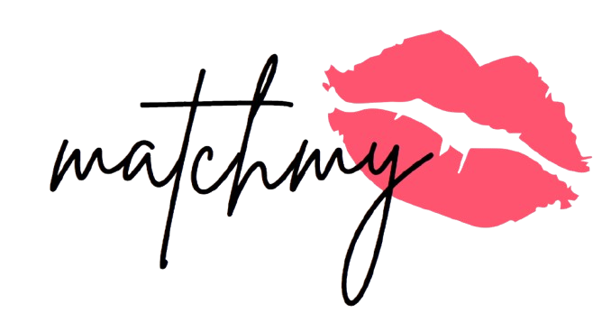
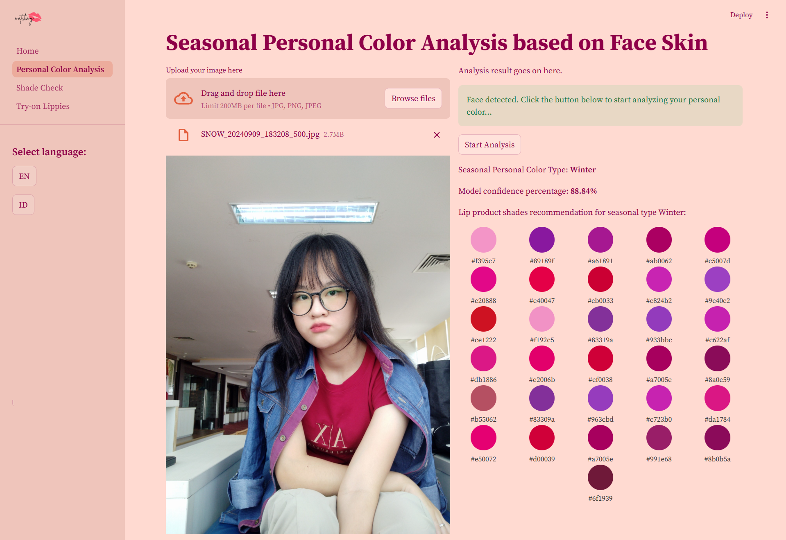
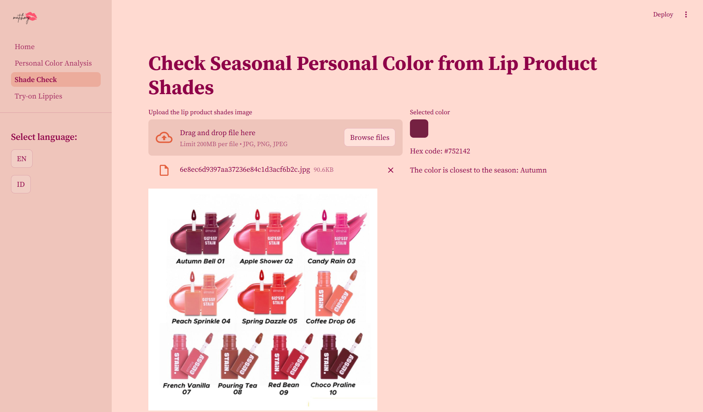
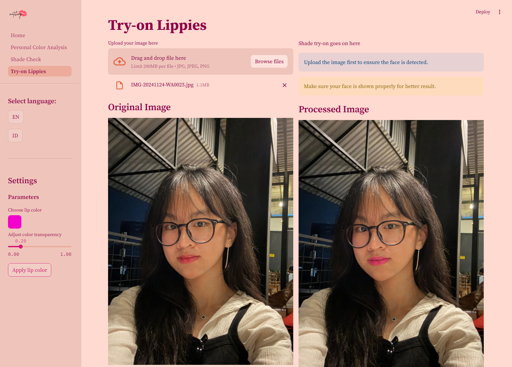

 # MatchMyLips

**MatchMyLips** adalah sebuah aplikasi berbasis web yang dikembangkan menggunakan Streamlit dengan tujuan untuk membantu pengguna memilih rona pewarna bibir yang sesuai berdasarkan analisis Seasonal Personal Color menggunakan model Convolutional Neural Network (CNN). Aplikasi ini juga menyediakan fitur try-on untuk mencoba rona pewarna bibir via citra wajah yang diunggah.

---

## Fitur Utama
1. **Deteksi Seasonal Personal Color dari Citra Wajah Pengguna**:
   - Pengguna mengunggah foto citra wajah ke aplikasi.
   - Aplikasi menganalisis citra menggunakan model CNN yang disiapkan untuk mendeteksi Seasonal Personal Color.
   - Aplikasi memberikan rekomendasi rona pewarna bibir yang sesuai dengan tipe Seasonal Personal Color yang dideteksi.



2. **Deteksi Seasonal Personal Color dari Rona Pewarna Bibir**:
   - Pengguna mengunggah foto citra rona pewarna bibir ke aplikasi.
   - Aplikasi menganalisis kategori Seasonal Personal Color dari rona warna yang di-klik.
   - Hasil yang diberikan berupa kode Hex dari warna beserta tipe Seasonal Personal Colornya.



3. **Virtual Try-on**:
   - Pengguna mengunggah foto citra wajah ke aplikasi.
   - Pengguna memilih kode warna Hex yang ingin diterapkan pada bibir
   - Aplikasi akan memproses dan menerapkan kode warna Hex yang dipilih pada citra bibir menggunakan masking dengan teknik alpha blending.



---

## Teknologi yang Digunakan
- **Frontend**:
  - Framework: Streamlit
  - Library: OpenCV (untuk pengolahan gambar)

- **Backend**:
  - Framework: PyTorch (untuk model CNN)
  - Python

---

## Cara Instalasi dan Menjalankan Aplikasi

1. **Clone Repository**:
   ```bash
   git clone https://github.com/itscatus/websheesh.git
   cd matchmylips
   ```

2. **Instalasi Dependensi**:
   Pastikan Anda memiliki Python dan pip terinstal. Kemudian jalankan:
   ```bash
   pip install -r requirements.txt
   ```

3. **Menjalankan Aplikasi**:
   ```bash
   streamlit run Home.py
   ```

4. **Akses Aplikasi**:
   - Buka browser dan akses: `http://localhost:8501`

---

## Struktur Proyek
```
matchmylips/
├── .streamlit/
│   └── config.toml   # Script untuk mengatur tampilan streamlit
├── Home.py   # Main script untuk menjalankan aplikasi dan menampilkan homepage
├── assets/
│   ├── colors.csv               # File dataset rona pewarna bibir
│   ├── cosmetics.png            # File image untuk page icon halaman Shade Check
│   ├── house-door.png           # File image untuk page icon halaman Home
│   ├── lips.png                 # File image untuk page icon halaman Try-on Lippies
│   ├── logo.png                 # File image untuk logo aplikasi
│   └── person-bounding-box.png  # File image untuk page icon halaman Personal Color Analysis
├── facer/   # Library model untuk deteksi dan parsing wajah
├── pages/
│   ├── Personal_Color_Analysis.py   # Script untuk halaman personal color analysis 
│   ├── Shade_Check.py               # Script untuk halaman cek pewarna bibir
│   └── Try-on_Lippies.py            # Script untuk halaman try-on pewarna bibir
├── utils/
│   ├── functions.py      # Script untuk mengecek apakah wajah terdeteksi atau tidak
│   └── translations.py   # Script dictionary terjemahan bahasa Indonesia dan bahasa Inggris
├── requirements.txt   # Daftar dependensi Python
├── best_mobilenetv2_model.pth    # File model mobilenetv2 yang digunakan untuk prediksi personal color analysis dari citra kulit wajah  
└── README.md   # Dokumentasi proyek
```

---

## Pengembang
- Nama: Felicia Natania Lingga
- Universitas: Universitas Padjadjaran
- Kontak: felicia21001@mail.unpad.ac.id

---

## Lisensi
Aplikasi ini dirilis di bawah lisensi MIT. Silakan merujuk ke file LICENSE untuk detail lebih lanjut.

